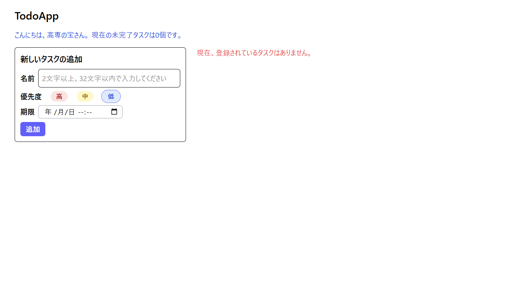
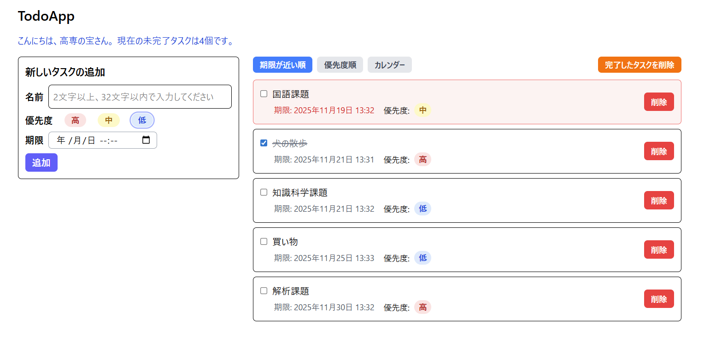
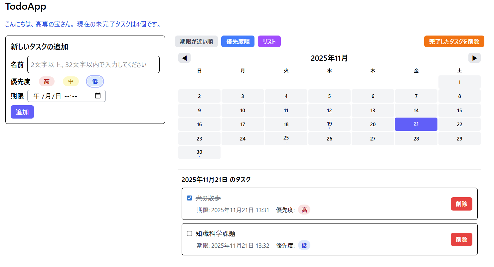

# TodoApp

React、TypeScript、Tailwind CSS を使用し、ローカルストレージでデータを永続化した高機能な「Todoアプリ」です。

## 🚀 アプリケーション URL (GitHub Pages)
https://kariya-v2.github.io/react-todo-app/

## 📌 コンセプト

実用的なタスク管理を実現するアプリケーション。
タスクの優先度と期限を設定し、リスト表示とカレンダー表示の両方でタスクを管理できます。
期限切れタスクの可視化により、タスク忘れを防止し、効率的なタスク管理をサポートします。

## ✨ 主な機能

### 基本機能
- **タスク追加**：タスク名、優先度（高・中・低）、期限を指定して追加
- **タスク完了管理**：チェックボックスでタスク完了/未完了を切り替え
- **タスク削除**：個別削除または完了済みタスクをまとめて削除
- **バリデーション**：タスク名は 2〜32 文字で入力チェック

### 表示機能
- **リスト表示**：
  - ソート機能：「期限が近い順」「優先度順」の 2 種類
  - 同一優先度の場合は期限が近い順に自動で並び替え
  - 期限切れタスクは赤いボーダーと背景で強調表示
  
- **カレンダー表示**：
  - 月単位のカレンダーを表示
  - タスクがある日付は日付下に青いドットで表示
  - 日付をクリックするとその日のタスク一覧を表示


### 期限管理
- **期限表示**：タスク詳細に期限を「YYYY年MM月DD日 HH:mm」形式で表示
- **期限切れ警告**：期限切れタスクは枠が赤くハイライト表示
- **タスク追加時の警告**：期限入力が過去日の場合、入力欄が赤くなり警告表示

### データ永続化
- **LocalStorage 連携**：ブラウザのローカルストレージにタスクを自動保存
- **自動復元**：アプリ起動時に保存済みタスクを復元

## 🛠️ 技術スタック

### フロントエンド
- **フレームワーク**：React 19.x + TypeScript
- **ビルドツール**：Vite
- **スタイリング**：Tailwind CSS
- **UIコンポーネント**：
  - FontAwesome（アイコン表示）
  - dayjs（日付操作・フォーマット）

### 主要ライブラリ
| パッケージ | 用途 |
|-----------|------|
| react | UI フレームワーク |
| react-dom | DOM 操作 |
| typescript | 型安全性 |
| tailwind-css | CSS フレームワーク |
| dayjs | 日付・時刻操作 |
| uuid | タスク ID 生成 |
| @fortawesome/react-fontawesome | アイコン表示 |
| @fortawesome/free-solid-svg-icons | SVG アイコン |
| tailwind-merge | Tailwind クラス結合 |

### 開発ツール
- ESLint：コード品質チェック
- TypeScript：型チェック
- Vite：高速ビルド・開発サーバー


## 🚀 使い方

### セットアップ
```bash
npm install
npm run dev
```

### ビルド
```bash
npm run build
```

### プレビュー
```bash
npm run preview
```

## 📅 開発期間

**2025年10月23日~2025年11月17日(約30時間)** 

## 📝 ライセンス

MIT License

Copyright (c) 2025 Pinkball

Permission is hereby granted, free of charge, to any person obtaining a copy
of this software and associated documentation files (the "Software"), to deal
in the Software without restriction, including without limitation the rights
to use, copy, modify, merge, publish, distribute, sublicense, and/or sell
copies of the Software, and to permit persons to whom the Software is
furnished to do so, subject to the following conditions:

The above copyright notice and this permission notice shall be included in all
copies or substantial portions of the Software.

THE SOFTWARE IS PROVIDED "AS IS", WITHOUT WARRANTY OF ANY KIND, EXPRESS OR
IMPLIED, INCLUDING BUT NOT LIMITED TO THE WARRANTIES OF MERCHANTABILITY,
FITNESS FOR A PARTICULAR PURPOSE AND NONINFRINGEMENT. IN NO EVENT SHALL THE
AUTHORS OR COPYRIGHT HOLDERS BE LIABLE FOR ANY CLAIM, DAMAGES OR OTHER
LIABILITY, WHETHER IN AN ACTION OF CONTRACT, TORT OR OTHERWISE, ARISING FROM,
OUT OF OR IN CONNECTION WITH THE SOFTWARE OR THE USE OR OTHER DEALINGS IN THE
SOFTWARE.